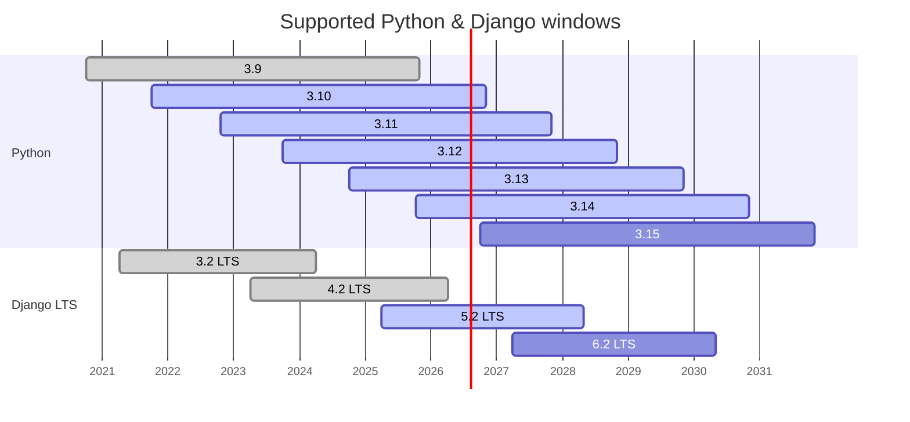

# DLRSP compatibility

Org-wide Python and Django compatibility tracking hub for the published `django-*` packages.

- **Parent issue per version** - one issue per active Python minor and Django LTS release.
- **Sub-issue per package** - closed when the package declares support (pyproject classifiers), open when it still needs work.
- **Native rollup** - the parent's sub-issue progress reads as compatible packages / total.

Per-repository `compat:` milestones keep the pull-request link and EOL countdown inside each package.

<!-- BEGIN compat-timeline (generated) -->

_Generated from `compat-timeline.yaml` (timeline updated 2026-06-25). Edit the timeline, not this block._

### Support windows

### Python

| Version | Released | End of life | Status |
| --- | --- | --- | --- |
| 3.9 | 2020-10-05 | 2025-10-31 | EOL |
| 3.10 | 2021-10-04 | 2026-10-31 | EOL in 117d |
| 3.11 | 2022-10-24 | 2027-10-31 | Supported |
| 3.12 | 2023-10-02 | 2028-10-31 | Supported |
| 3.13 | 2024-10-07 | 2029-10-31 | Supported |
| 3.14 | 2025-10-07 | 2030-10-31 | Supported |
| 3.15 | 2026-10-01 | 2031-10-31 | Scheduled |

### Django (LTS only)

| Version | LTS | Released | End of life | Status |
| --- | --- | --- | --- | --- |
| 3.2 | yes | 2021-04-06 | 2024-04-01 | EOL |
| 4.2 | yes | 2023-04-03 | 2026-04-07 | EOL |
| 5.2 | yes | 2025-04-02 | 2028-04-30 | Supported |
| 6.2 | yes | 2027-04-01 | 2030-04-30 | Scheduled |

Sources verified against [Python devguide](https://devguide.python.org/versions/), [Django download](https://www.djangoproject.com/download/) and [endoflife.date](https://endoflife.date/python).

<!-- END compat-timeline (generated) -->
